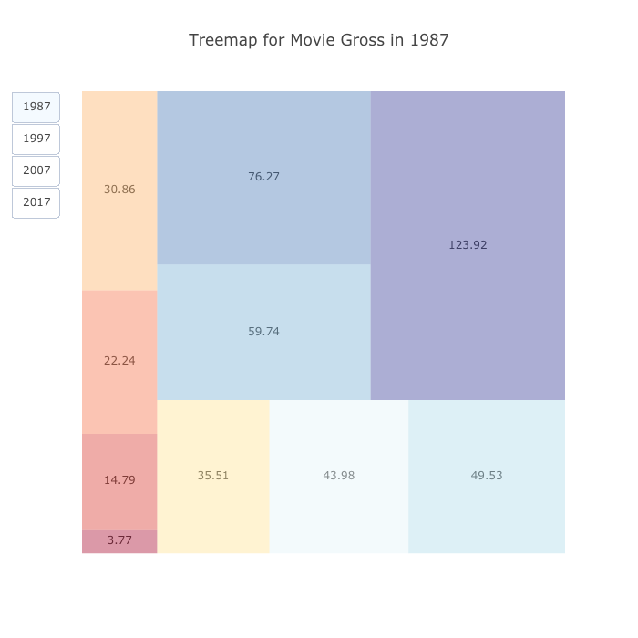

# Plotly-Visualization
cleaned_data.csv: cleaned data used to create visualizations
### Treemap
[treemap.py](../blob/master/treemap%20-%20interactive.py): plots tree map of movie gross of 1987, 1997, 2007, 2017.

[bubble chart animation.ipynb] : plots bubble chart of movie rating as x-axis, movie runtime as y-axis, movie gross as the size of bubble, movie year as the slider and movie genre as the color of the bubble. It should run in the Jupyter notebook in order to see the output animation. 

### Line Chart 
[line chart.py](../blob/master/valence%20line%20chart%20-%20interactive.py): selects four Harry Potter movies and plot the valence, the level of positiveness or negativeness of a track, change in the order of the soundtracks in the album (which happen to follow the order of when they are used in the movie, thus a good indicator of movie plots). The name of the track could serve as a short summary of the plot of the whole story.

            
### Radar Chart 
[radar chart.py](../blob/master/radar%20chart-%20interactive.py): plots radar chart comparing two sound tracks’ six musical attributes in a single movie based on users’ choice. It’s actually an Dash app supported by poorly. The code running result is a domain where the result is showed. Must open the domain manually and then select anything you want.

                                                  
### Network graph
1. Basic Analysis with [igraph](../blob/master/network%20analysis.py)
2. Cluster Analysis with [networkx](../blob/master/network%20analysis.py)
3. 3D Visualization with [plotly](../blob/master/network%20analysis.py)

movie genre network - interactive.py: plots a giant network where movies and genres are nodes and the edges represents ‘belong to’. Note a movie may have more than one genres. The size of the nodes represents the degrees. Allow for selected different color scale for both nodes and edges.

networkanalysis.py: extracts desired subset of cleaned data and conducts basic network analysis and clustering analysis.

